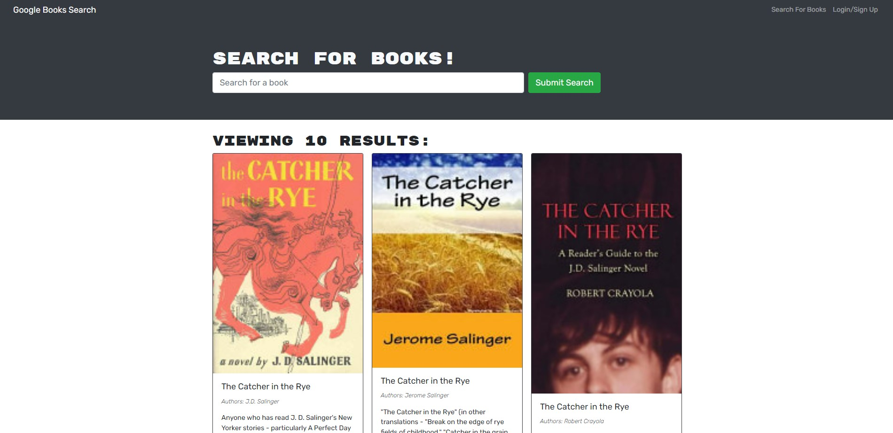

# my-reading-list

## Table of Contents

- [Project Description](#Description)
- [Installation](#Installation)
- [Usage](#Usage)
- [Contact Me](#ContactMe)

## Description

This search engine will render a single page application (SPA) with the search results of books. There is a description of the books and you have the option to sign in and/or up to be an user. Once you are an user, you will have an option to save books to a list and remove books from your liked page.

### Motivation for creating this project

I built this application because I wanted to use the Apollo Studio Explorer interface paird with the GraphQL queries and Mutations. This was a challenging project but I learned a lot about developing application through the MERN stack.

### What problem does this solve?

This application will let users search and save books that they would like to read eventually. It gives a description of all of the books rendered on the page so you can find a book that sounds appealing to you.

## Installation

In order to download and use my code, you will have to clone my repo and type npm install

## Usage

Remember all of the books you are interested in by cloning this repo and signing up!

## Contact Me

To see this project on Heroku visit https://my-readingbook-list.herokuapp.com/

See other projects I have created at https://github.com/DouglasRed

Contact me at douglasred63@yahoo.com for any questions you have about my project.
